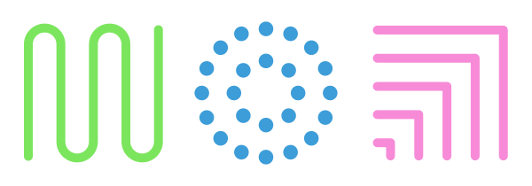
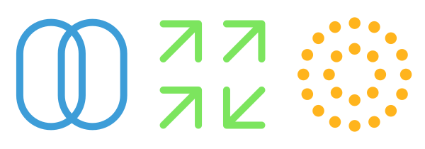
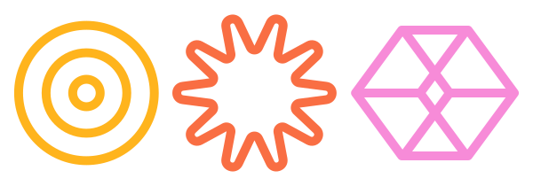
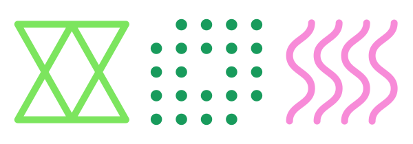

This webside is made as a challenge from the company [Terra](https://terrahq.com/).
In this challenge, we need to create a website where the client can add different tasks in the project they are doing with Terra,and be connected to ClickUp to improve the project managers life.

<h1 style="padding:0px;margin:0px;">Project Objectives</h1> 
 
<br><br>


- Make project managers life easier.
- Create a project management website that connects with ClickUp.
- Create users with different types of roles : Client, Project Manager, Admin.
- Give the client a much cleaner and better way to ask for the needs they will have in their projects

<h1 style="padding:0px;margin:0px;">Functionality</h1> 
 
<br>

### Backend

- Creation and administration of users, projects and tasks.
- Modular organization between controllers, models and routes.
- Deploy of the backend infraestructure using Docker Compose.
- Hability to add images using multer.
- Click Up connection using Axios and the Click Up API.
- Data API connection using Axios.


### Frontend

- Client, Admin and Project Manager structure for backend API usage.
  - Admin.
    - Create Project Managers and Clients.
    - Access all routes of the backend API.
    - Do everything a Project Manager can do.
  - Project Manager.
    - Create Clients.
    - Create Projects.
    - Add Clients to Projects.
    - Remove Clients from Projects.
    - Add Comments to Tasks.
  - Client.
    - Create tasks inside Projects.
    - Remove tasks inside Projects.
    - Edit tasks inside Projects.
    - Change their password.
    - Send tasks to ClickUp.
- Connect with backend using Fetch.
- Showcase Project Completion using charts.
- Secure way to Login and Register (apart from first login, which is different).


<h1 style="padding:0px;margin:0px;">Technologies</h1> 
 
<br>


### Backend

- TypeScript
- Node.js
- Express
- MongoDB
- Mongoose
- Docker
- Docker Compose
- dotenv
- Axios
- Jsonwebtoken
- Multer


### Frontend

- HTML
- CSS
- JavaScript
- React
- Chart.js
- Fetch

### Apis

- ClickUp Api
- Data Api
- Backend Api


<h1 style="padding:0px;margin:0px;">Project Structure</h1> 
 
<br><br><br>

```
├── client
│   ├── eslint.config.js
│   ├── index.html
│   ├── package.json
│   ├── package-lock.json
│   ├── public
│   │   ├── images
│   │   │   ├── icons-card.png
│   │   │   ├── icons-instructions.png
│   │   │   └── logo_terra_vista.svg
│   │   └── vite.svg
│   ├── README.md
│   ├── src
│   │   ├── components
│   │   │   ├── createProjectForm
│   │   │   │   ├── createProjectForm.css
│   │   │   │   └── createProjectForm.jsx
│   │   │   ├── doughnutChart
│   │   │   │   └── DoughnutChart.jsx
│   │   │   ├── layout
│   │   │   │   └── Layout.jsx
│   │   │   ├── Modal
│   │   │   │   ├── Modal.css
│   │   │   │   └── Modal.jsx
│   │   │   ├── navbar
│   │   │   │   ├── AsideNavbar.jsx
│   │   │   │   ├── Navbar.css
│   │   │   │   └── TopNavbar.jsx
│   │   │   ├── notifications
│   │   │   │   ├── NotificationCard.jsx
│   │   │   │   └── Notifications.jsx
│   │   │   ├── projectCard
│   │   │   │   ├── ProjectCard.css
│   │   │   │   └── ProjectCard.jsx
│   │   │   ├── projectList
│   │   │   │   ├── ProjectList.css
│   │   │   │   └── ProjectList.jsx
│   │   │   ├── taskCard
│   │   │   │   ├── TaskCard.css
│   │   │   │   └── TaskCard.jsx
│   │   │   ├── taskList
│   │   │   │   ├── TaskList.css
│   │   │   │   └── TaskList.jsx
│   │   │   └── userCard
│   │   │       ├── UserCard.css
│   │   │       └── UserCard.jsx
│   │   ├── context
│   │   │   ├── AuthContext.jsx
│   │   │   └── ProjectContext.jsx
│   │   ├── index.css
│   │   ├── main.jsx
│   │   ├── pages
│   │   │   ├── auth
│   │   │   │   ├── auth.css
│   │   │   │   ├── CreateUser.jsx
│   │   │   │   ├── Login.jsx
│   │   │   │   └── Register.jsx
│   │   │   ├── instructions
│   │   │   │   ├── Instructions.css
│   │   │   │   └── Instructions.jsx
│   │   │   ├── profile
│   │   │   │   ├── Profile.css
│   │   │   │   └── Profile.jsx
│   │   │   ├── projects
│   │   │   │   ├── ProjectDetail.css
│   │   │   │   ├── ProjectDetail.jsx
│   │   │   │   ├── Projects.css
│   │   │   │   └── Projects.jsx
│   │   │   ├── requestDetail
│   │   │   │   ├── RequestDetail.css
│   │   │   │   └── RequestDetail.jsx
│   │   │   ├── requestForm
│   │   │   │   ├── RequestForm.css
│   │   │   │   └── RequestForm.jsx
│   │   │   ├── root
│   │   │   │   └── Root.jsx
│   │   │   ├── taskDetail
│   │   │   │   ├── TaskDetail.css
│   │   │   │   └── TaskDetail.jsx
│   │   │   └── users
│   │   │       ├── Users.css
│   │   │       └── Users.jsx
│   │   ├── Routes.jsx
│   │   └── utils
│   │       ├── auth.js
│   │       ├── clickup.js
│   │       ├── cookies.js
│   │       ├── fetch.js
│   │       ├── projects.js
│   │       ├── tasks.js
│   │       └── user.js
│   └── vite.config.js
├── ml_api
│   ├── api_model.py
│   ├── Dockerfile
│   ├── models
│   │   ├── category_classifier.pkl
│   │   ├── model_duracion.pkl
│   │   └── priority_classifier.pkl
│   └── requirements.txt
├── package.json
├── package-lock.json
├── README.md
├── server
│   ├── docker-compose.yml
│   ├── Dockerfile
│   ├── package.json
│   ├── package-lock.json
│   ├── public
│   │   ├── assets
│   │   └── images
│   ├── src
│   │   ├── app.ts
│   │   ├── config
│   │   │   └── mongoose.ts
│   │   ├── controllers
│   │   │   ├── auth
│   │   │   │   ├── authApiController.ts
│   │   │   │   └── authController.ts
│   │   │   ├── clickUp
│   │   │   │   ├── clickUpApiController.ts
│   │   │   │   ├── clickUpController.ts
│   │   │   │   ├── clickUpWebhookController.ts
│   │   │   │   └── taskSyncController.ts
│   │   │   ├── project
│   │   │   │   ├── projectApiController.ts
│   │   │   │   └── projectController.ts
│   │   │   └── user
│   │   │       ├── userApiController.ts
│   │   │       └── userController.ts
│   │   ├── models
│   │   │   ├── project.ts
│   │   │   ├── syncLogs.ts
│   │   │   ├── task.ts
│   │   │   └── user.ts
│   │   ├── routes
│   │   │   ├── authRouter.ts
│   │   │   ├── clickUpRouter.ts
│   │   │   ├── projectRouter.ts
│   │   │   ├── router.ts
│   │   │   └── userRouter.ts
│   │   └── utils
│   │       ├── bcrypt.ts
│   │       ├── clickUp
│   │       │   ├── clickUpProjectUtils.ts
│   │       │   ├── clickUpTaskUtils.ts
│   │       │   └── webhookUtils.ts
│   │       ├── errors
│   │       │   ├── clickUpError.ts
│   │       │   ├── controllerError.ts
│   │       │   ├── multerError.ts
│   │       │   ├── projectError.ts
│   │       │   └── userErrors.ts
│   │       ├── isJsonCheck.ts
│   │       ├── middlewares
│   │       │   ├── multerMiddleware.ts
│   │       │   ├── roleMiddleware.ts
│   │       │   └── sameUserMiddleware.ts
│   │       ├── modelsSelect.ts
│   │       ├── passwordChecking.ts
│   │       └── token.ts
│   └── tsconfig.json
```

